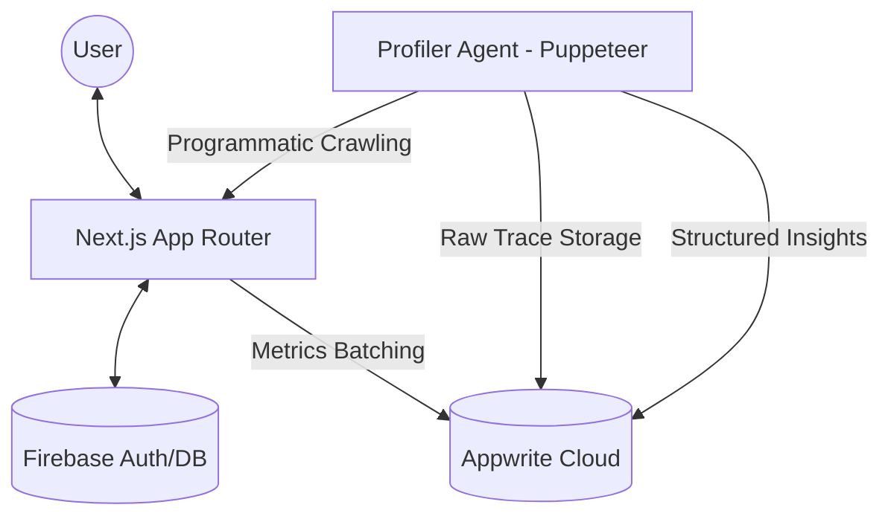

# Project Architecture

Kisan Kamai is built on a modern serverless stack focused on extreme performance and scalability. This document outlines the system components and data flows.

## 🏗️ High-Level System Architecture

The following diagram illustrates how the Next.js frontend interacts with the serverless backend services.

---

## ⚡ Performance Monitoring Blocks

The performance system consists of two distinct data pipelines to ensure real-time visibility and deep-dive profiling.

### 1. Live Monitoring (Client-Side)
Captures real-world user data from the browser.
- **Trigger**: Page View / Interaction.
- **Provider**: `PerformanceMonitor.tsx`.
- **Logic**: Batches Core Web Vitals (LCP, INP, CLS) every 5 seconds.
- **Destination**: Appwrite `live_performance_logs`.

### 2. Autonomous Profiler (Server-Side)
Simulates deep profiling using automated headless browsers.
- **Trigger**: Scheduled script execution.
- **Tool**: Puppeteer + Chrome DevTools Protocol.
- **Output**: Full Network/CPU JSON Traces.
- **Destination**: Appwrite Storage (`performance_traces`).

---

## 🛠️ Software Stack Details

| Component | Software/Service | Version Details |
| :--- | :--- | :--- |
| **Frontend Framework** | Next.js | v14.2.3 (App Router) |
| **Styling Engine** | Tailwind CSS | v3.4.3 |
| **UI Animations** | Framer Motion | v12.38.0 |
| **Primary Backend** | Appwrite | SDK v24.1.1 |
| **Auth/Legacy Storage**| Firebase | v12.12.0 |
| **Automation Engine** | Puppeteer | v24.40.0 |
| **Metrics Standard** | Web Vitals | v5.2.0 |

---

## 🔌 Data Schema Blocks

### Performance Insights Collection
The structured data stored in Appwrite for analytics.

| Field | Type | Description |
| :--- | :--- | :--- |
| `pageUrl` | String | URL being profiled |
| `lcp` | Float | Largest Contentful Paint (ms) |
| `cls` | Float | Cumulative Layout Shift |
| `ttfb` | Float | Time to First Byte (ms) |
| `traceFileId` | String | Link to raw JSON file in Storage |
| `timestamp` | DateTime | When the profile was captured |
