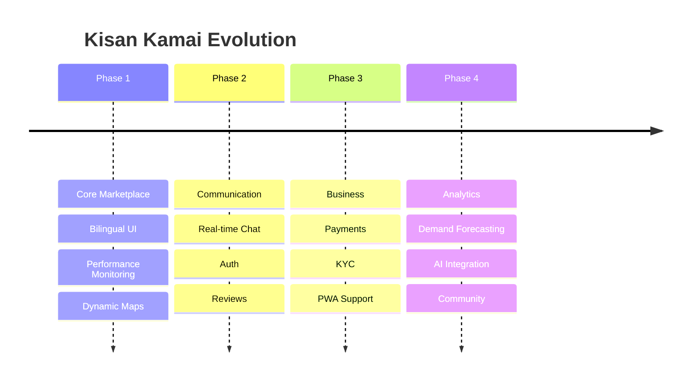

# Project Roadmap

The vision for Kisan Kamai is to become the premier agricultural equipment marketplace in Western India. This roadmap outlines the development phases from MVP to at-scale platform.

## 📍 Current Phase: Foundation (v0.1) - [IN PROGRESS]
Focus on core marketplace navigation, bilingual support, and advanced performance infrastructure.
- [x] Bilingual Support (English/Marathi).
- [x] 21+ Fully Functional Static Pages.
- [x] Dark Mode / Glassmorphism Design.
- [x] Autonomous Performance Monitoring & Profiling.
- [x] Dynamic Region Maps (Leaflet).

---

## 🏗️ Phase 2: Engagement (v0.2)
Enhancing user interaction and direct communication between owners and renters.
- [ ] **Smart Messaging System**: Real-time chat via Firebase for inquiry handling.
- [ ] **User Authentication**: Secure Login/Register flows for personalized dashboards.
- [ ] **Booking Request Logic**: Initial non-payment reservation system.
- [ ] **Equipment Reviews**: Feedback system for service quality.

---

## 💳 Phase 3: Transaction (v0.3)
Formalizing the rental business logic and financial transparency.
- [ ] **Payment Integration**: Razorpay/Stripe for secure rental deposits.
- [ ] **KYC Verification**: Trust-building for equipment safety and insurance.
- [ ] **Rent Calculation Engine**: Automated pricing based on hours/acreage.
- [ ] **Mobile App (PWA)**: Better accessibility in rural areas with low network.

---

## 📈 Phase 4: Intelligence (v1.0)
Leveraging data to provide value-added services to the agricultural community.
- [ ] **Predictive Demand Maps**: AI-driven insights for owners on where to deploy equipment.
- [ ] **Weather-Linked Renting**: Adjusting equipment availability based on local climate data.
- [ ] **Maintenance Reminders**: IoT-lite integration for tracking equipment health.
- [ ] **Farmer Network Expansion**: Communities and knowledge-sharing blocks.

---

## 🗺️ Roadmap Diagram

